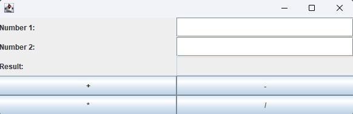
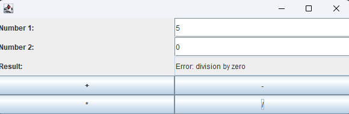
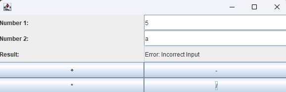

# Calculator MVC
This is a simple calculator application implemented using the MVC (Model-View-Controller) pattern.

## Features
- Supports addition, subtraction, multiplication, and division.
- Handles division by zero with appropriate error messages.
- Displays results and error messages in a user-friendly way.
- Automatically gets all methods from CalculatorModel without passing operations

## How to run
- Clone the repository.
- Compile the project using your preferred Java IDE or the command line.
- Run the main class `CalculatorApp`.

## Screenshots

Image 1: User Interface

Image 2,3: Error Handling

## Error with commits
This is repository has recommits from SDP repository because I pushed in wrong repository.